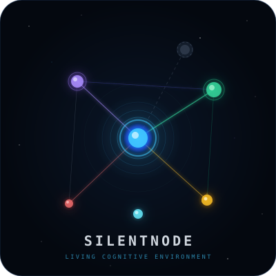

<div align="center">



# SilentNode

**A living cognitive environment — not a tool, not an OS, but a universe.**

*Privacy-first · Local-only · Rust core · GPU rendered · Zero telemetry*

---

[](https://rustlang.org)
[]()
[]()
[]()

</div>

---

## What is SilentNode?

SilentNode is a **living cognitive graph engine** — a system that turns your thoughts, projects, ideas, memories, and creative work into an evolving three-dimensional universe that you can see, navigate, and interact with.

It is not:
- a note-taking app
- a project manager
- an AI assistant
- a productivity tool

It is a **cognitive environment** — a digital space that grows alongside you, reflects your mental patterns, and makes your thinking visible.

> "Not an application. Not an operating system. A living cognitive environment."

---

## Core Philosophy

Traditional software is static. Humans are not.

| Traditional Systems | SilentNode |
|---|---|
| Store files | Store cognitive evolution |
| Organize data | Organize thought |
| Display information | Visualize memory, focus, and identity |
| Forget what you did | Remember how you thought |
| External reminders | Internal pattern reflection |
| File-centric | Thought-centric |

SilentNode does not tell you what to do. It shows you what you already are.

---

## Architecture

```
┌─────────────────────────────────────────────────────────────────────┐
│                        SilentNode Universe                          │
│                                                                     │
│   ┌─────────────────────────────────────────────────────────────┐   │
│   │                   React Web UI  (port 5173)                 │   │
│   │   26 panels · 3D force graph · real-time aura · live data   │   │
│   └──────────────────────┬──────────────────────────────────────┘   │
│                          │  HTTP /api/* (proxy)                     │
│   ┌──────────────────────▼──────────────────────────────────────┐   │
│   │               Rust Axum REST API  (port 3030)               │   │
│   │   150+ endpoints · async · shared workspace · JWT-free      │   │
│   └──────────────────────┬──────────────────────────────────────┘   │
│                          │                                          │
│   ┌──────────────────────▼──────────────────────────────────────┐   │
│   │                  Rust Core Engine                            │   │
│   │                                                             │   │
│   │  Graph Engine          Audio Engine (cpal)                  │   │
│   │  Barnes-Hut gravity    Procedural synthesis                 │   │
│   │  O(n log n) layout     13 atmosphere presets                │   │
│   │                                                             │   │
│   │  GPU Renderer (wgpu)   Temporal Engine                      │   │
│   │  WGSL shaders          Full change history                  │   │
│   │  Particle systems      Time-travel reconstruction           │   │
│   │  Orbit camera          Fossil detection                     │   │
│   │                                                             │   │
│   │  Encryption Vault      Pattern Systems                      │   │
│   │  Argon2id + XChaCha20  Oracle · Ritual · Mirror             │   │
│   │  Zeroize-on-drop       Seasons · Civilizations              │   │
│   └──────────────────────┬──────────────────────────────────────┘   │
│                          │  PyO3 bridge (optional)                  │
│   ┌──────────────────────▼──────────────────────────────────────┐   │
│   │              Python Analysis Brain (optional)               │   │
│   │   ML pattern detection · Audio parametric mapping           │   │
│   │   Content ingestion · Louvain clustering                    │   │
│   └─────────────────────────────────────────────────────────────┘   │
│                                                                     │
│   ┌──────────────────────────────────────────────────────────────┐  │
│   │  Storage                                                     │  │
│   │  SQLite vaults · local settings · encrypted backup exports   │  │
│   └──────────────────────────────────────────────────────────────┘  │
└─────────────────────────────────────────────────────────────────────┘
```

SilentNode is split into three visible surfaces and one shared core:

| Surface | Command | What it is for |
|---|---|---|
| **Web UI** | `cargo run -- api 3030` + `cd web && npm run dev` | Daily use: graph, nodes, vaults, schedule, ML suggestions, calendar, settings, Telegram notification setup |
| **TUI** | `cargo run -- tui` | Keyboard-first terminal control when you do not want the browser |
| **WGPU desktop renderer** | `cargo run -- launch [width] [height]` | Native GPU window for the cognitive universe renderer |
| **CLI** | `cargo run -- <command>` | Automation, scripts, exports, snapshots, diagnostics, ML training |

All surfaces operate on the same workspace and SQLite vault. A node created in the Web UI is immediately part of the same graph that the TUI, CLI, API, and renderer use.

---

## Quick Start

### Requirements

- Rust 1.79+
- Node.js 18+
- npm 9+
- Python 3.10+ only if you want the optional ML/Python tools

### Run

```bash
# Clone and enter the project
git clone <repo> && cd ApexForge_SilentNode

# Build the Rust core
cargo build

# Start the API server on port 3030
cargo run -- api 3030

# In a second terminal, start the Web UI
cd web
npm install
npm run dev

# Open in browser
# http://localhost:5173
```

The Vite dev server proxies `/api/*` to `http://localhost:3030`, so the browser talks to the Rust API without extra configuration.

### Run The TUI

```bash
cargo run -- tui
```

Use this for a terminal-native view of the graph, journal, focus trail, analytics, and daily state.

### Run The Native WGPU Window

```bash
cargo run -- launch 1280 800
```

This opens the native GPU renderer. It uses the Rust renderer path (`wgpu` + `winit` + WGSL shaders), not the browser renderer.

### With Audio Engine

```bash
cargo run --features audio -- api 3030
```

### With Python ML / Analysis

```bash
pip install -r requirements.txt
cargo run --features python -- api 3030
```

### Full Build (all features)

```bash
cargo build --features "audio,python,process"
```

---

## Features

### Feature Map

| Area | What exists now | Why it matters |
|---|---|---|
| **Nodes** | Idea, Memory, Project, Person, Artifact, Media, Process, World, Ghost, Fossil, Other/custom type | One graph can hold thoughts, habits, study plans, projects, files, people, and custom categories without forcing everything into one note type |
| **Rich node detail** | Editable content, nickname, type, custom color, schedule metadata, quick links | A node can behave like a small Obsidian-style page while still living inside the graph |
| **Focus modes** | Glance, Read, Edit, DeepWork | Attention is not binary; a quick look and a deep session affect the graph differently |
| **Scheduling** | Once, daily, weekly, interval, custom days, reminders metadata | Nodes can represent recurring life systems such as prayer, Quran reading, study, deep work, or exam preparation |
| **Vaults** | Multiple SQLite vaults with switch/create/delete/import flow | Separate personal, work, academy, and project universes without mixing their graphs |
| **ML classifier** | Local text-aware node type suggestions, feedback, diagnostics, training | The system learns from corrections and suggests better types over time |
| **Graph intelligence** | Related nodes, clusters, resonance, PageRank, bridges, heatmap | Shows hidden structure: what is central, what is neglected, what should connect |
| **Temporal memory** | Snapshots, day reconstruction, archaeology, fossils | You can inspect how your thinking changed, not only what exists today |
| **Notifications** | Local settings + Telegram test sender | Bot token/chat ID can be configured from Settings; automatic schedule dispatch can build on this channel |
| **Exports/imports** | DOT, CSV, Markdown, Obsidian task import | Data can move out of the system and external work can be ingested |
| **Privacy** | Local SQLite, local settings, no account, no telemetry | The graph is yours; no core workflow requires a cloud service |

### Web UI

The Web UI is the main daily interface. It is a Vite + React app backed by the Rust API.

Main spaces:

| Space | Panels | Use it for |
|---|---|---|
| **Command** | Pulse, Journal, Forge, Lineage, Terminal, Next | Daily capture, current season, journaling, creation, next-focus suggestions |
| **Universe** | Graph, Nodes, Souls, Life, Void, Silence | Visual navigation, node management, project souls, civilizations, quiet/void states |
| **Memory** | Trail, Heatmap, Mirror, Archaeology, Days | Reviewing what you actually focused on and reconstructing past days |
| **Systems** | Settings, Vaults, Vision, Modes, Weather, Calendar, Membrane, Processes, Health | Configuration, vault control, calendar/tasks, process linking, system health |
| **Dream** | Dream, Identity | Synthesis, lore, shadow projects, living signature |

Important Web UI capabilities:

- **3D graph navigation**: select nodes, drag them, follow live force movement, inspect labels, focus camera.
- **Node editor**: edit content, nickname, type, custom `Other` class, custom color, and schedule.
- **Quick linking**: connect one node to another from the detail/editor panel.
- **ML suggestions**: when adding a node, the local ML classifier suggests a type and accepts feedback.
- **Vault management**: create/open/delete vaults and import Obsidian tasks.
- **Settings**: configure notification channels such as Telegram token/chat ID.

### TUI

The TUI is the terminal interface built with `ratatui`.

Use it when:

- you are already in the terminal and want fast keyboard access;
- you want a low-resource interface without browser rendering;
- you want to inspect graph state, journal, focus, and system panels over SSH or a terminal-only machine.

Run:

```bash
cargo run -- tui
```

The TUI reads and writes the same SQLite vault as the Web UI. It is not a separate database.

### WGPU Renderer

SilentNode also has a native GPU renderer using:

- `wgpu` for cross-platform GPU rendering;
- `winit` for the native window;
- WGSL shaders in `shaders/`;
- instanced node rendering;
- edge rendering;
- aura/background pass;
- particle systems;
- orbit camera.

Run:

```bash
cargo run -- launch 1280 800
```

The WGPU renderer is useful because it keeps the core visual universe independent from the browser. The Web UI is practical for daily work; the WGPU path is the native rendering foundation for a future desktop/OS-level experience.

### Rust API

The API is an Axum server exposing the graph, temporal systems, ML endpoints, vaults, calendar, settings, import/export, and intelligence panels.

Run:

```bash
cargo run -- api 3030
```

Common endpoints:

| Endpoint | Purpose |
|---|---|
| `GET /nodes` | List nodes |
| `POST /nodes` | Create typed node |
| `PUT /nodes/:id` | Edit node content/type/schedule/custom fields |
| `POST /thought` | Add a quick thought |
| `POST /focus` | Record Glance/Read/Edit/DeepWork |
| `GET /vaults` | List vaults |
| `POST /vaults` | Create vault |
| `POST /vaults/switch` | Switch active vault |
| `GET /ml/status` | ML model status |
| `POST /ml/classify` | Classify text into node type |
| `POST /ml/feedback` | Teach the classifier from correction |
| `GET /settings/notifications` | Read notification settings without exposing the token |
| `PUT /settings/notifications` | Save Telegram notification settings |
| `POST /settings/notifications/test` | Send Telegram test notification |

### Python ML Layer

The Rust core works without Python. Python is used for local ML and deeper analysis tools.

Current ML responsibilities:

- tokenization and multilingual aliases;
- local classifier training;
- feedback learning from user corrections;
- diagnostics for class balance and confidence;
- advisor/daily-plan style analysis;
- optional Python bridge via `--features python`.

Typical commands:

```bash
python3 -m pytest tests/test_ml.py -q
cargo run -- ml-train
python3 -m silentnode_py.ml.cli diagnostics
python3 -m silentnode_py.ml.cli daily-plan
```

If the classifier keeps suggesting the same type, add feedback through the UI or run training after enough corrected examples.

### The Living Universe

Every object in SilentNode is a **node** — a living entity with:

| Property | What it means |
|---|---|
| **Gravity** | Importance — how central this idea is to your thinking |
| **Entropy** | Decay rate — how quickly it fades without attention |
| **Velocity** | Activity — how fast it's evolving right now |
| **Contagion heat** | How much it's influencing neighboring ideas |

Nodes attract each other through **Idea Gravity** (Barnes-Hut O(n log n) quadtree simulation). Important ideas drift toward the center. Neglected ideas drift to the silent edge.

---

### Entropy Engine

Nothing is permanent by default.

Every idea has an entropy state:

| State | Visual | Meaning |
|---|---|---|
| **Vibrant** | Bright, full color, active particles | Recently touched, fully alive |
| **Cooling** | Subtle desaturation | Activity slowing |
| **Fading** | Visible decay, dimming | Low engagement |
| **Crystallizing** | Wireframe shell forming | Near collapse — stable enough to fossilize |
| **Ghost** | Transparent, dashed outline | Dissolved — preserved but dormant |

When entropy reaches critical level:
- The node enters **Ghost state** — it does not disappear, it transforms
- All connections become invisible but intact
- The node can be fully resurrected at any time

Attention reverses entropy. Opening a node, writing a journal entry, connecting it to active work — all reverse decay.

---

### Temporal Engine — Full History of Every Thought

SilentNode records **every change** to every node, edge, and journal entry.

```bash
# Create a temporal snapshot
cargo run -- snapshot-all

# Reconstruct how a node looked 30 days ago
cargo run -- reconstruct-day 2026-04-30

# Compare two points in time
cargo run -- compare-days 2026-04-01 2026-05-01

# Enter archaeology mode on a node
cargo run -- archaeology <node-id>
```

**Thought Archaeology**: Every node has geological depth — layers of previous states stacked in time. You can descend through history, resurrect old versions, and fork past states into new living structures.

**Thought Fossils**: Ideas that have existed unchanged for a long time become fossils — immune to entropy, visible as mineral-toned crystalline structures, foundational bedrock of your cognitive universe.

---

### Cognitive Pattern Systems

#### Cognitive Seasons
The system derives your current creative season from behavioral observation:

| Season | Characteristics | Visual Expression |
|---|---|---|
| **Spring** | Rapid idea generation, high connection activity | Universe brightens, particles multiply |
| **Summer** | Deep focus, high output, strong trails | Intense illumination, warm temperature |
| **Autumn** | Reflection, consolidation, archaeology | Gradual desaturation, ghost visibility |
| **Winter** | Low output, Void usage, incubation | Near-silence, slow ambient motion |

No user input required. The system observes and reflects.

#### Oracle Layer
The Oracle is not AI. It is the emergent pattern-recognition of a system that has observed you long enough to anticipate you.

Oracle signal types:
- **NodeAnticipation** — predicts which nodes you'll visit before you do
- **GhostReturn** — signals when thinking returns toward an abandoned area
- **SeasonTransition** — forewarns of approaching cognitive phase shift
- **HighResonancePair** — detects deep structural similarity between distant ideas
- **EntropyWarning** — estimates days-to-ghost from entropy trajectory

#### Ritual Engine
Detects recurring behavioral patterns:
- Opening sequences (how you begin work)
- Warm-up behaviors (activity before deep focus)
- Closure rituals (how you end sessions)
- Periodic rituals (daily, weekly, seasonal patterns)

Once detected, rituals are named using real node content — not "Ritual [3]" but "Rust compiler → Error analysis → Documentation".

#### Cognitive Mirror
A self-portrait derived entirely from behavioral data:
- **Stated vs. actual priorities** — what you say matters vs. where focus trails actually go
- **Blind spots** — regions receiving almost no attention despite connection to active projects
- **Obsession mapping** — topics receiving disproportionate attention relative to output
- **Evolution portrait** — how your thinking has changed across time periods
- **Creative patterns** — when you are actually most productive, not when you think you are

---

### Living Civilizations

When enough related nodes form deep connections, they stop being a cluster and become a **Civilization** — a self-organizing cognitive society with:

- Internal hierarchy and governance (dominant attractor node)
- Supporting infrastructure (secondary nodes)
- Frontier expansion (peripheral ideas)
- Cultural identity (unique visual signature and color palette)
- Historical layers (the archaeology of how this society formed)

Civilizations interact:
- **Expand** — absorbing neighboring ideas
- **Trade** — forming cross-civilization bridges
- **Conflict** — when two civilizations share contested conceptual territory
- **Merge** — when a common foundation is discovered
- **Collapse** — when the governing concept loses gravity

Crystallization is available when a civilization reaches density + stability threshold — transforming it into a **Knowledge Crystal**: immune to entropy, gravitational anchor for future ideas, permanently named and identifiable.

---

### Void Zones

Not every idea is ready to exist.

Void Zones are regions of **intentional emptiness**:
- Zero gravitational pull — void entities don't attract or repel
- No connection formation — void entities don't link automatically
- No entropy — void entities don't decay
- No classification pressure — ideas exist without needing to become anything

Ideas in the Void simply wait.

When an idea is ready — either the user pulls it out, or the system detects **resonance** (a void entity aligns with active concepts) and signals its existence.

---

### Resonance Chambers

When the system detects deep structural similarity between two ideas from **completely separate regions of the universe**, it creates a Resonance Chamber — a temporary spatial event where the two nodes are brought together.

The user sees the resonance and chooses:
- **Connect** — a permanent bridge is established
- **Note** — the resonance is recorded as a Lore Entry without connecting
- **Dismiss** — the chamber dissolves

Resonances are not surface similarity (shared keywords). They are detected via TF-IDF cosine similarity at a pre-threshold level — structural patterns the user has not consciously noticed.

---

### Focus Trails

Every interaction with a node leaves a trace. Over time, these traces form **Focus Trails** — visible pathways across the universe showing where attention has traveled.

Trail properties:
- Recent trails appear bright and clearly defined
- Old trails fade gradually into translucent wisps
- Frequently traveled paths become wide and luminous
- Rarely revisited routes thin into barely visible threads

The trail system surfaces:
- Which areas receive consistent attention vs. superficial visits
- Recurring loops — areas visited compulsively without resolution
- Neglected regions — areas untouched for extended periods
- The gap between stated priorities and actual cognitive energy

---

### Silent Contracts

Silent Contracts are **implicit obligations** the system detects from behavioral patterns — goals you carry internally but have never written down:

Detection signals:
- Repeated approach without engagement (you navigate near it but never open it)
- Journal declaration without follow-through (stated intention, zero activity)
- High-gravity nodes with no output (you think about it but never act)
- Temporal decay of high-priority entities (was central, drifted outward unresolved)

Three interactions:
1. **Fulfill** — commit to it; the contract becomes a living node with full properties
2. **Release** — consciously dissolve it; a temporal marker records the closure
3. **Leave** — the contract continues to exist, patient and present, adding no pressure

---

### Digital Shadows

Digital Shadows are ideas that exist in a permanent state of **becoming** — started but never completed, revisited repeatedly without resolution, never formally closed.

Shadow detection:
- High approach frequency, low output
- Cyclical revisitation at regular intervals
- Journal references without resolution markers
- Entropy midpoint — not active, not dead, suspended

Three interactions:
1. **Illuminate** — bring it fully into the active universe and commit
2. **Name** — formally acknowledge it without committing; stabilizes its position
3. **Release** — conscious closure with a dissolution animation

An unnamed shadow simply continues — following, waiting, persisting.

---

### Digital Membrane

SilentNode is sovereign territory. Nothing enters or exits without passing through the **Digital Membrane**.

Control levels:
- **Network** — which external connections are permitted
- **Process** — which external processes can communicate with SilentNode
- **Data** — which data can leave the universe
- **Media** — which external content can be ingested

Every crossing is logged. The membrane's integrity score is always visible. High-traffic regions of the membrane appear brighter.

---

### Process Sovereignty

No process runs invisibly. Every computational process is visible:

```bash
cargo run -- ps                        # list visible processes
cargo run -- process-link <pid> <node> # link a process to a cognitive node
```

Processes are linked to cognitive structures:
- A compiler process → linked to its codebase architecture node
- A test runner → linked to the quality concept node of its project
- A data script → linked to the research cluster it serves

Process history is navigable through Thought Archaeology.

---

### Calendar Intelligence

The calendar is not a separate application. Calendar events exist as **Temporal Nodes** within the graph:

- They carry gravity — approaching events increase in visual mass
- They cast shadows backward — preparation activity links to the event
- They create anticipation fields — nearby nodes become more active as events approach
- They leave impressions forward — post-event reflections link to the original node

Intelligence features:
- Optimal focus window detection based on historical trail patterns
- Procrastination signature detection — absence of preparation before known deadlines
- Cognitive Season transitions marked as temporal events

---

### Identity Engine

Every system instance develops a **Living Signature** — a continuously evolving visual symbol derived from:

- The total shape of the universe over time
- Dominant Civilizations that have formed
- Cognitive Seasons experienced
- Knowledge Crystals formed
- Artifacts created in The Forge
- Rituals maintained
- Shadows carried

The Living Signature changes imperceptibly month to month. Year to year, the transformation becomes visible. No two signatures are alike. No signature is ever finished.

**Personal Lore System**: Significant moments become Lore Entries — completed projects, breakthroughs, pivotal decisions, abandoned paths. The system structures these as narrative arcs:
- Origin Arcs (foundational periods)
- Conflict Arcs (periods of friction and failure)
- Ascension Arcs (rapid growth and breakthrough)
- Silence Arcs (incubation and rest)
- Legacy Arcs (completed chapters that inform everything after)

**Hero's Journey Mapping**: The system optionally maps behavioral patterns onto universal narrative structures — call, threshold, trials, transformation, return. No mythology is imposed. The patterns are observed and reflected.

---

### Ambient Sound Architecture (optional)

With `--features audio`, SilentNode generates a continuous evolving ambient soundscape derived from the live state of the universe:

| Region | Sound |
|---|---|
| Active development clusters | Low, rhythmic mechanical texture |
| Research regions | Ambient hum, harmonic resonance |
| Creative clusters | Expansive, melodic atmospheric audio |
| Ghost regions | Deep silence with occasional distant resonance |
| Void Zones | Absolute silence — a felt absence of sound |
| Crystallized structures | Clear, sustained tones |
| High-entropy regions | Dissonant, fragmented audio |

Seasonal sound:
- **Spring** — light, ascending harmonic movement
- **Summer** — full, warm, sustained resonance
- **Autumn** — fading complexity, descending movement
- **Winter** — near-silence, occasional deep resonance, long decay

Each session applies ±7% LFO/frequency variation — no two sessions sound identical.

---

### The Forge

The Forge is a dedicated environment for creation. When a user enters The Forge:
- The surrounding universe recedes into background state
- A dedicated creation surface appears adapted to the artifact type
- The aura shifts to a Creation state
- Sound architecture shifts to Forge-specific composition

Every artifact created is linked to its origins:
- Which ideas spawned it
- Which research informed it
- Which past artifacts influenced it
- Which Resonance Chamber connections contributed

Creation activity in The Forge energizes the universe — linked nodes gain entropy reversal, connected Civilizations receive velocity boosts, the Lore System records the event.

---

## CLI Reference

All commands are run through Cargo during development:

```bash
# Core
cargo run -- status
cargo run -- add-thought "<text>"
cargo run -- connect <source-id> <target-id> [weight] [edge-type]
cargo run -- disconnect <source-id> <target-id>
cargo run -- delete-node <node-id>
cargo run -- revive-node <node-id>
cargo run -- journal "<text>"

# Navigation
cargo run -- list-nodes [query]
cargo run -- show-node <node-id>
cargo run -- related <node-id> [limit]
cargo run -- trail [hours]
cargo run -- heatmap [days]

# Temporal
cargo run -- snapshot-all
cargo run -- temporal-status
cargo run -- record-change <node-id>
cargo run -- reconstruct-day <YYYY-MM-DD>
cargo run -- compare-days <YYYY-MM-DD> <YYYY-MM-DD>
cargo run -- archaeology <node-id>
cargo run -- fossil-check <node-id>
cargo run -- fossilize <node-id>
cargo run -- excavate <node-id>
cargo run -- lore

# Pattern Systems
cargo run -- season
cargo run -- oracle
cargo run -- rituals
cargo run -- mirror [days]
cargo run -- heatmap7 [days]
cargo run -- contracts
cargo run -- resonances
cargo run -- civilizations
cargo run -- crystallize
cargo run -- shadows

# Void
cargo run -- void-node <node-id>
cargo run -- unvoid-node <node-id>
cargo run -- void-check <node-id>

# Identity & Narrative
cargo run -- signature
cargo run -- shadow-projects
cargo run -- lore-chronicle
cargo run -- heroes-journey

# External World
cargo run -- ps
cargo run -- weather

# Interaction
cargo run -- illuminate-shadow <node-id>
cargo run -- fulfill-contract <node-id>
cargo run -- resonances

# Server & UI
cargo run -- api [port]
cargo run -- tui
cargo run -- launch [width] [height]

# Audio (--features audio)
cargo run --features audio -- audio-state
cargo run --features audio -- audio-play <atmosphere> <seconds>
cargo run --features audio -- audio-stop
cargo run --features audio -- audio-list

# Sync
cargo run -- sync-serve [port]
cargo run -- sync-pull <host:port>
cargo run -- sync-push <host:port>

# Export
cargo run -- export-dot [path]
cargo run -- export-csv [path]
cargo run -- export-edges-csv [path]
cargo run -- export-markdown [path]

# ML
cargo run -- ml-status
cargo run -- ml-train
cargo run -- ml-ghost-risk
python3 -m silentnode_py.ml.cli diagnostics
python3 -m silentnode_py.ml.cli daily-plan
```

---

## Web Interface

The Web UI runs at `http://localhost:5173` during development:

```bash
cargo run -- api 3030
cd web
npm run dev
```

The production bundle is created with:

```bash
cd web
npm run build
```

### Spaces

| Space | Purpose |
|---|---|
| **Command** | Today's pulse, journal, forge, intelligence |
| **Universe** | 3D graph, nodes, souls, civilizations, void, silence |
| **Memory** | Trail, heatmap, mirror, archaeology, day reconstruction |
| **Systems** | Settings, vaults, modes, weather, calendar, membrane, processes, health |
| **Dream** | Dream synthesis, identity and lore |

### Graph Controls

| Control | Action |
|---|---|
| **Drag** | Move nodes to preferred position |
| **Scroll** | Zoom in/out |
| **Click node** | Select and focus camera |
| **Click background** | Deselect |
| **Center** | Reset camera to overview |
| **Focus** | Camera fly-to selected node |
| **Pause/Resume** | Halt or resume force simulation |
| **Drift** | Reheat simulation for organic movement |
| **Labels** | Toggle node labels |

---

## TUI Interface

The terminal UI is the practical fallback when the browser is not the right environment.

```bash
cargo run -- tui
```

It is useful for:

- quick local inspection;
- SSH sessions;
- keyboard-only review;
- low-overhead work where a WebGL graph is unnecessary.

Because the TUI uses the same Rust workspace and SQLite vault, it is not a separate mode of data. It is another door into the same universe.

---

## Native WGPU Interface

The native renderer is separate from the Web UI. It exists so the visual universe can run directly on the GPU without depending on browser APIs.

```bash
cargo run -- launch 1280 800
```

Renderer components:

| Component | Role |
|---|---|
| `src/renderer/mod.rs` | GPU device, queue, offscreen render target, camera buffer |
| `src/renderer/window.rs` | Native window and event loop |
| `src/renderer/camera.rs` | Orbit/pan/zoom camera |
| `src/renderer/node_pass.rs` | Instanced node rendering |
| `src/renderer/edge_pass.rs` | Edge rendering |
| `src/renderer/aura_pass.rs` | Full-screen aura/background pass |
| `src/renderer/particles.rs` | Particle data and rendering path |
| `shaders/*.wgsl` | GPU shader programs |

The Web UI is better for editing and daily workflows. The WGPU renderer is better for native visual performance and future desktop integration.

---

## Data & Privacy

SilentNode is built on an absolute privacy foundation:

- **Local-first** — all data stays on your machine
- **Offline-capable core** — no internet dependency for graph, vaults, ML training, TUI, WGPU rendering, or local analysis
- **Encrypted backup support** — export/import uses Argon2id + XChaCha20-Poly1305
- **Telemetry-free** — zero data leaves your system
- **Self-controlled** — you own the database files completely
- **No account required** — no hosted account or cloud workspace is required
- **Optional integrations** — Telegram notifications only send data if you explicitly configure a bot token/chat ID in Settings

Data files:
```
data/
  silentnode.sqlite     # primary storage
  vaults.json           # vault index
  settings.local.json   # local secrets/settings, gitignored
```

Vault encryption:
```bash
cargo run -- export-encrypted <password> [output-path]
cargo run -- import-encrypted <password> [input-path]
cargo run -- rotate-vault-password <current-password> <new-password>
```

---

## Storage Schema

SilentNode uses **8 core tables** in SQLite:

| Table | Contents |
|---|---|
| `node` | All cognitive nodes with entropy, gravity, position |
| `connects` | All edges between nodes with type and weight |
| `focus_event` | Every focus session with duration and mode |
| `journal_entry` | All journal entries with semantic tags |
| `temporal_snapshot` | Full universe snapshots for time-travel |
| `lore_entry` | Narrative lore entries from the Personal Lore System |
| `silent_contract` | Detected implicit obligations |
| `process_record` | Linked process history |

---

## Node Types

| Type | Meaning |
|---|---|
| `idea` | Free-form idea, thought, question, or concept |
| `memory` | Personal memory, journal-like recall, past event |
| `project` | Active project, long-running initiative, build target |
| `person` | Person, relationship, collaborator, contact |
| `artifact` | Created output: document, codebase, design, file, object |
| `media` | Book, video, article, podcast, course, external resource |
| `process` | Habit, recurring workflow, task system, routine |
| `world` | Domain, environment, organization, external system |
| `ghost` | Dormant/decayed node retained for archaeology |
| `fossil` | Stabilized old node preserved as bedrock |
| `other` | Custom class with custom label and color |

For daily systems such as prayer, Quran reading, English listening, exam preparation, or deep work, use `process` when it is a repeated routine. Use `project` when it has a defined output or deadline. Use `other` only when you want your own custom category name and color.

---

## Edge Types

| Type | Meaning |
|---|---|
| `Connection` | General relationship |
| `Resonance` | Deep structural similarity |
| `Temporal` | Time-based relationship (before/after) |
| `Causal` | One entity caused or enabled another |
| `Focus_trail` | Derived from focus session movement |

---

## Build Targets

```bash
# Core only (no Python, no audio, no process scan)
cargo build

# With ambient audio synthesis
cargo build --features audio

# With Python ML bridge (deep analysis commands)
cargo build --features python

# With richer process scanning (sysinfo)
cargo build --features process

# Full (all features)
cargo build --features "audio,python,process"

# Python extension (import silentnode_core from Python)
cargo build --features python-ext

# Release (optimized)
cargo build --release
```

---

## Tests

```bash
cargo test
```

Test suite covers:
- Core graph engine (gravity, contagion, silence analysis)
- Identity system (living signature, shadow projects)
- Phase 6–7 pattern systems (civilizations, crystals, void, oracle)
- GPU renderer (headless device, camera, passes)
- Temporal engine (archaeology, fossils, lore detection)

---

## Project Structure

```
ApexForge_SilentNode/
├── src/
│   ├── main.rs                  # CLI entry point (130+ commands)
│   ├── lib.rs                   # library root
│   ├── api.rs                   # REST API (150+ endpoints, Axum)
│   ├── domain.rs                # core types (NodeType, EdgeType, etc.)
│   ├── storage.rs               # SQLite persistence layer
│   ├── surreal.rs               # SurrealDB persistence layer
│   ├── workspace.rs             # SilentNodeWorkspace (main state)
│   ├── gravity.rs               # Barnes-Hut gravity simulation
│   ├── contagion.rs             # BFS energy propagation
│   ├── entropy.rs               # entropy state machine
│   ├── silence.rs               # silence analysis (TF-IDF, bridges)
│   ├── sync.rs                  # TCP peer sync
│   ├── python.rs                # PyO3 bridge
│   ├── tui.rs                   # terminal UI (8 tabs)
│   ├── dream.rs                 # dream synthesis
│   ├── dashboard.rs             # HTML dashboard export
│   ├── analytics.rs             # health metrics
│   ├── intelligence.rs          # intelligence layer
│   ├── audio/
│   │   ├── mod.rs               # AudioEngine, SoundMode, AudioEvent
│   │   ├── synth.rs             # Oscillator, LFO, Reverb, Synthesizer
│   │   └── atmosphere.rs        # AtmosphereKind, blend_atmospheres
│   ├── renderer/
│   │   ├── mod.rs               # renderer root
│   │   ├── window.rs            # windowed GPU renderer (winit)
│   │   ├── camera.rs            # orbit/pan/zoom camera
│   │   ├── node_pass.rs         # node billboard render pass
│   │   ├── edge_pass.rs         # edge quad render pass
│   │   ├── aura_pass.rs         # full-screen aura background
│   │   └── particles.rs         # particle compute + render
│   ├── temporal/
│   │   ├── mod.rs               # TemporalEngine
│   │   ├── archaeology.rs       # ArchaeologySession
│   │   ├── reconstruction.rs    # MemoryReconstructor
│   │   ├── fossils.rs           # FossilEngine
│   │   └── lore.rs              # LoreArcDetector
│   ├── identity/
│   │   ├── mod.rs               # LivingSignature, IdentityEngine
│   │   └── shadow_projects.rs   # ShadowProjectDetector
│   ├── membrane/
│   │   └── mod.rs               # DigitalMembrane
│   ├── portals/
│   │   └── mod.rs               # PortalManager
│   ├── process/
│   │   └── mod.rs               # ProcessSovereignty
│   ├── calendar/
│   │   └── mod.rs               # CalendarEngine, CalendarIntelligence
│   └── systems/
│       ├── mod.rs
│       ├── seasons.rs           # CognitiveSeasonDetector
│       ├── oracle.rs            # OracleLayer
│       ├── ritual.rs            # RitualEngine
│       ├── mirror.rs            # CognitiveMirror
│       ├── heatmap.rs           # ThoughtHeatmapEngine
│       ├── contracts.rs         # SilentContractDetector
│       ├── resonance.rs         # ResonanceChamberEngine
│       ├── civilization.rs      # CivilizationDetector
│       ├── crystallization.rs   # CrystallizationEngine
│       ├── void_manager.rs      # VoidManager
│       ├── shadow.rs            # DigitalShadowDetector
│       ├── cognitive_weight.rs  # CognitiveWeightSystem
│       ├── tectonics.rs         # TectonicDetector
│       ├── souls.rs             # ProjectSoul, derive_all_souls
│       ├── weather.rs           # WeatherSystem
│       └── mirror.rs            # CognitiveMirror
├── shaders/
│   ├── node.wgsl                # node billboard (entropy fade, glow, selection)
│   ├── edge.wgsl                # edge quads (weight thickness, ghost dash)
│   ├── particle.wgsl            # particle compute shader
│   └── aura.wgsl                # full-screen FBM nebula background
├── web/
│   ├── src/
│   │   ├── App.tsx              # main app (spaces, panels, live aura)
│   │   ├── api.ts               # typed API client
│   │   ├── types.ts             # TypeScript types
│   │   ├── components/          # 30+ React components
│   │   │   ├── Graph3D.tsx      # 3D force graph (stable nodeMap, drag)
│   │   │   ├── IntelligenceView.tsx  # oracle + synthesis + resonance
│   │   │   ├── MirrorView.tsx   # cognitive self-portrait
│   │   │   ├── ArchaeologyView.tsx   # temporal descent
│   │   │   ├── ForgeView.tsx    # creation environment
│   │   │   └── ...              # 25 more panels
│   │   └── styles/
│   │       └── global.css       # design system + aura states
│   └── vite.config.ts           # dev proxy → localhost:3030
├── silentnode_py/
│   ├── audio/
│   │   └── generator.py         # AudioStateMapper, parametric audio
│   ├── identity/
│   │   ├── signature.py         # LivingSignatureGenerator (SVG + ASCII)
│   │   └── chronicle.py         # PersonalChronicle, HeroJourneyMapper
│   └── ingestion/
│       └── engine.py            # IngestionEngine (7-step pipeline)
├── data/
│   ├── silentnode.sqlite        # primary database
│   └── vaults.json              # vault registry
├── docs/
│   └── vision.md                # complete system vision
├── assets/
│   └── logo.svg                 # project logo
└── tests/                       # integration test suite
```

---

## Planned (Phase 11–12)

- **Phase 11** — Optional AI Layer: local LLM integration for memory summarization, autonomous relation discovery, semantic search, idea synthesis
- **Phase 12** — NightOS Integration: native rendering layer, cognitive filesystem, adaptive workspace compositor, thought-centric shell integration

---

## Design Principles

1. **Privacy above everything** — no cloud, no telemetry, no external dependencies for core features
2. **Feel alive** — every part of the system has motion, decay, evolution. Nothing is static.
3. **Honest reflection** — the system does not flatter or motivate. It reflects what is actually true about your patterns.
4. **No forced pressure** — reminders and Telegram notifications are opt-in. The core system reflects patterns; it does not judge them.
5. **Performance matters** — Rust core, GPU rendering, parallel computation. SilentNode is designed to handle tens of thousands of nodes without degradation.
6. **Modular by design** — every system (audio, Python bridge, process scanning, SurrealDB) is an optional feature flag. The core works without any of them.

---

<div align="center">

*"Build not a tool. Build a living universe."*

**ApexForge / SilentNode**

</div>
